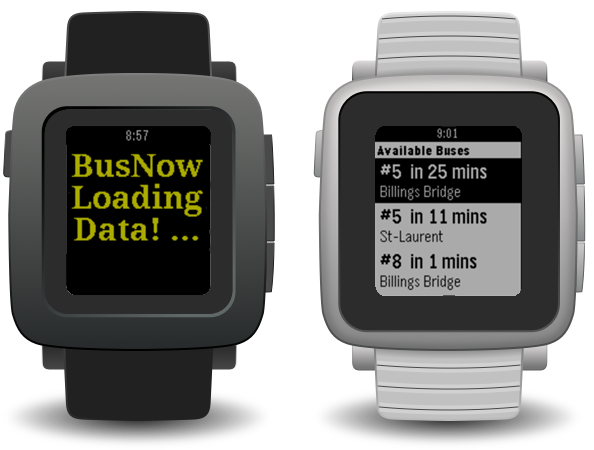

<h1>BusNow</h1>

BusNow is an app for pebble smartwatches that allows you to check the bus schedule, without pulling out your smartphone. BusNow use the phone loaction to determine the bus stop you are at.

<ul>

<li><h4>Non-Pebble API used</h4></li>
<li>Google Place API</li>
<li>OC Transpo API</li>
<li><h4>Pebble API used</h4></li>
<li>Timeline API</li>
<li>GPS API</li>
</ul>

